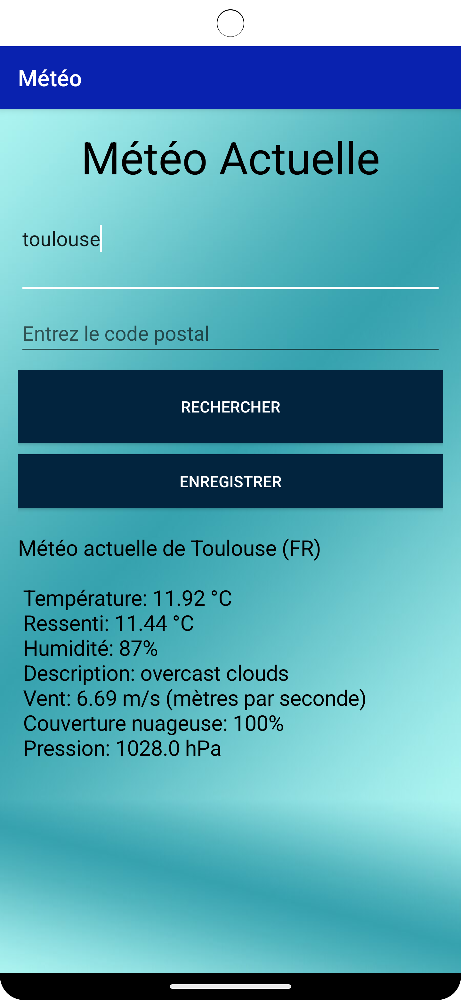

## Application Météo 🌦️
Une application météo avec un compte utilisateur construit en Java. 
Les données météorologiques sont alimentées par l'API OpenWeatherMap.

## Ressources 
Retrieve weather data:
**OpenWeatherMap**: https://openweathermap.org/ne 

## Fonctionnalités
- 🌦 Gives the weather situation of the day:
  Donne la situation météorologique du jour :
  - **Température** *(en °C)*
  - **Température ressentie** *(en °C)*
  - **Humidité** *(en %)*
  - **Description de la météo** (description en anglais)
  - **Vitesse du vent** *(en m/s)*
  - **Nuages**
  - **Pression** *(en hPa)*

- 📅 Accès rapide 24/7

- 🌍 Accédez à la météo pour des millions d'endroits en tapant le nom de la ville ou le code de la ville.

- 🛑 Application sécurisée et privée avec un accès personnalisé pour chaque utilisateur via une adresse e-mail et un mot de passe.

- 🌐 Application coder en anglais avec un visual en français 

## Besoins
* Android studio last version
* JDK 11
* Android SDK 32
* Java version 11
* Supports API Level +21
* Taille de la machine virtuelle : 1440 x 3040 ou 1080 x 2160

## Participants
 * Mistry Darshan
 * Tanguy Thomas
 * Morouche Lina

## Screenshoots 
 * Ils sont dans le dossier WheatherApplication-master.
 * 6 screenshoots de l'application 

 * 
 * 
 * 
 * 
 * 
 * 